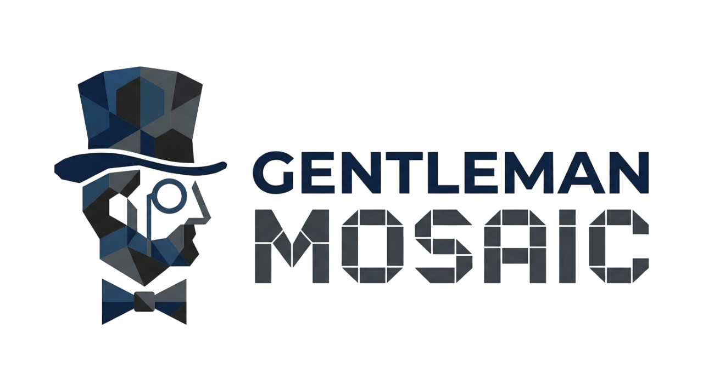
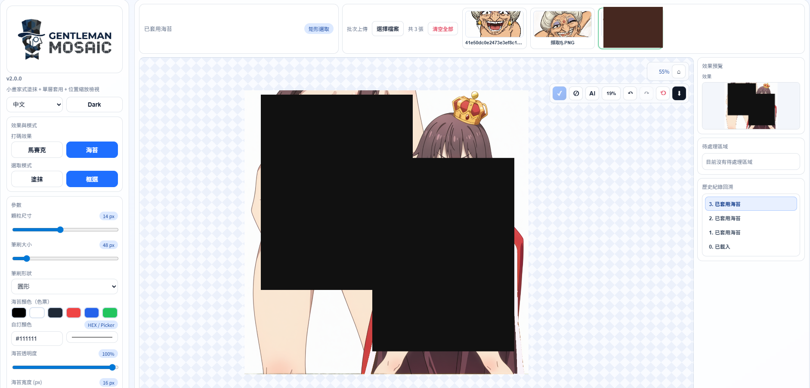

# Gentleman Mosaic v2.0.0



## UI Preview


## Release Info
- Version: `v2.0.0`
- Updated on: `2026-03-31`

### What's New in v2.0.0
- Batch image upload and image switching (up to 30 files)
- Per-image state persistence: pending regions and history (Undo/Redo)
- Thumbnail right-click menu: delete image, download processed output
- Thumbnail shortcuts: left click select, `Ctrl + Click` multi-select, `Shift + Click` range select, `Ctrl + A` select all
- NSFW auto-detection (NudeNet) with adjustable threshold and model switch (`320n` / `640m`)
- Effects: Mosaic and Nori bars (color, opacity, width, gap, direction)
- Selection modes: Rectangle and Brush (circle/square)
- Dark mode + Chinese/English UI switching

## Requirements
- Windows (with `.bat` startup flow)
- Python 3.9+ (3.10+ recommended)
- Internet access for first-time Python dependency installation

## Install & Start (Recommended)

### One-Click Startup (Standalone)
1. Open the project root folder.
2. Make sure these files exist: `start_app.bat`, `launch.ini`, `standalone.html`.
3. Double-click `start_app.bat`.
4. The script will read config, create `.venv`, install dependencies, start backend API, and open `standalone.html`.

### Main `launch.ini` Settings
```ini
[backend]
enabled=1
use_venv=1
venv_dir=.venv
create_venv=1
python_cmd=python
host=127.0.0.1
port=7300
reload=0
auto_install_deps=1
```

Notes:
- `port` is written to `runtime-config.js`; frontend uses it to connect backend.
- Set `enabled=0` to disable backend (manual redaction only).

## Development Mode (React/Vite)
```bash
npm install
npm run dev
```

### Build
```bash
npm run build
npm run preview
```

## Basic Workflow
1. Upload multiple images or drag files into the canvas area.
2. Select a target image from the thumbnail row.
3. Choose effect type (Mosaic / Nori).
4. Mark regions with rectangle or brush.
5. Click apply to process current pending regions.
6. Use Undo/Redo when needed.
7. Right-click thumbnail to delete or download processed image.

## Notes
- First startup may take longer due to Python package installation.
- If `python` is unavailable, update `python_cmd` in `launch.ini`.
- Batch upload limit is 30 images; extra files are skipped.
